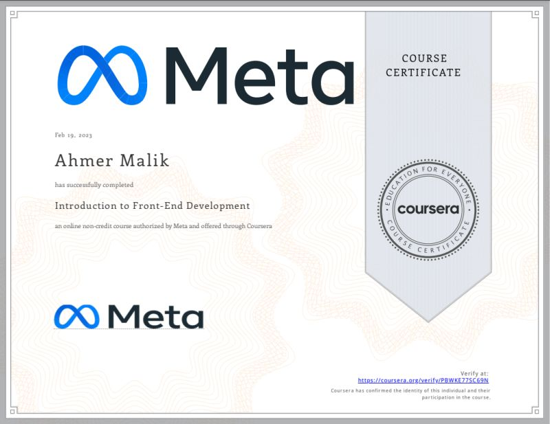

### Hi there, I'm Ahmer Malik 👋

<!--
**ahmermalik099/ahmermalik099** is a ✨ _special_ ✨ repository because its `README.md` (this file) appears on your GitHub profile.

Here are some ideas to get you started:

- 🔭 I’m currently working on ...
- 🌱 I’m currently learning ...
- 👯 I’m looking to collaborate on ...
- 🤔 I’m looking for help with ...
- 💬 Ask me about ...
- 📫 How to reach me: ...
- 😄 Pronouns: ...
- ⚡ Fun fact: ...
-->

## About Me
CS student with a diverse range of skills in programming languages and mobile development frameworks, possess a wealth of knowledge and experience in software development.

My expertise in Flutter, C++, Python, C#, .NET, Java, mobile development, and HTML/CSS highlights my versatility and adaptability in a rapidly evolving tech landscape. With such a robust skill set, I'm well-positioned to take on any programming challenge that comes in my way. My dedication to staying up-to-date with the latest trends and advancements in the field will undoubtedly lead me to excel in my future endeavors as a software developer. Apart from profesional life I'm also a good football player.

## Connect with me

 

# Highlights
Below are the Projects that I have made from scratch

# Flutter 

- [Zong HRM Application](Private Project) [Provider, White Label Application, WSO2 Authentication, RestApi's, Dynamic color scheme, content and menu for each company, Mercurial Minds Project]

- [Habit Tracker](https://github.com/ahmermalik099/habit_tracker_app) [Provider, Backend: DotNet Core] [Habit Tracker Backend](https://github.com/ahmermalik099/HabitTrackerBackend)

- [Hello Neighbour](https://github.com/ahmermalik099/hello_neighbour) [Getx, Google Maps, Collabed with friends(Github)]

- [Comic Hub](https://github.com/ahmermalik099/Comic-Hub-Flutter) [Getx, APIs, collabed with friends(Github)]

- [Movies App - Bloc](https://github.com/ahmermalik099/Flutter-Movies-App-Using-Bloc) [Bloc, Rest APIs]

- [Movies App - GetX](https://github.com/ahmermalik099/movie_app) [GetX, Rest APIs]

- [Attendance System](https://github.com/ahmermalik099/attendance_system) [Attemdance system from Schools and Colleges]

- [Games App](https://github.com/ahmermalik099/Games_App_Flutter) [APIs, Fetches and display all games of different publishers and genre]

- [BMI App](https://github.com/ahmermalik099/BMI-App-Flutter) [Used different flutter widgets for Undersatnding]

## Languages & Tools

 
 

# Certificates

